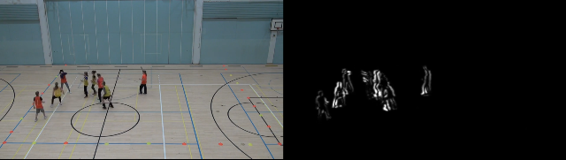

# CAVAPA

A C++ application that processes video to measure movement of persons within the field-of-view.

This is part of a research project with Heidi Pasi, Taru Lintunen, Martin Hagger. Jyväskylä University (Finland).

## Quickstart

1.	Convert video to image frames using ffmpeg.
`ffmpeg -i ./video.mpg -q:v 1 -qmin 1 -qmax 1 ./frames/video%06d.jpg`
2.	Run CAVAPA. It will process the images and create movement images and a CSV data file (containing the movement-measure for each frame of the video).
`cavapa -i ./frames -o ./cavapa_output`
3.	Convert CAVAPA output image frames into a video using ffmpeg:
`ffmpeg -i ./cavapa_output/movement%06d.jpg movement.mp4`

## Technical Summary

Cavapa is a command-line executable that is written in C++ for Microsoft Windows. Cavapa uses the following software libraries: 

*	Multi-threaded parallel processing:
[Microsoft Parallel Patterns Library (PPL)](https://docs.microsoft.com/en-us/cpp/parallel/concrt/parallel-patterns-library-ppl?view=vs-2019)
*	Command-line argument parsing and file-system access:
[Boost C++ 1.71](https://www.boost.org/). boost::filesystem & boost::program_options
*	Reading/writing image files (PNG, BMP, TIF, etc):
[Free Image & Free Image Plus](http://freeimage.sourceforge.net/).
 
The source code is a single file that is compiled using Microsoft Visual Studio 2019. System libraries from the Windows 10 SDK (10.0.17763.0) use the v142 platform toolset. Source code is available online at https://github.com/gregruthenbeck/CAVAPA2019 (NB: The git repo contains additional projects for charting in C# (incomplete) and processing accelerometer data (DataConverterCpp.vcxproj). The Cavapa executable is built using GregTrackCpp.vcxproj.

